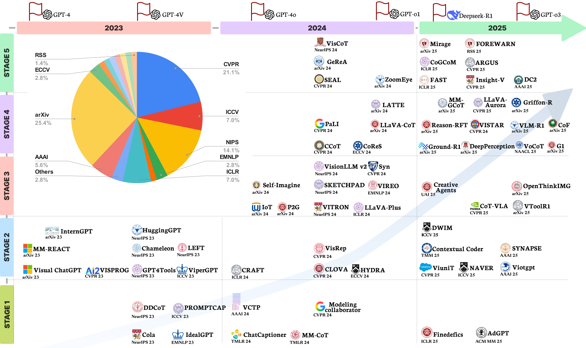
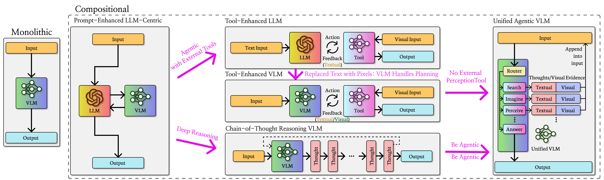
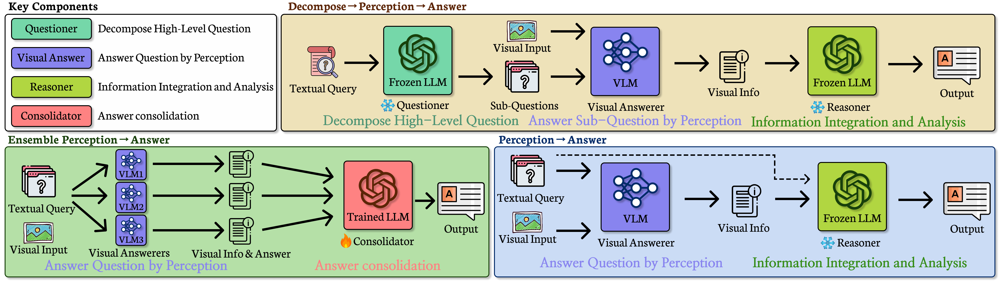
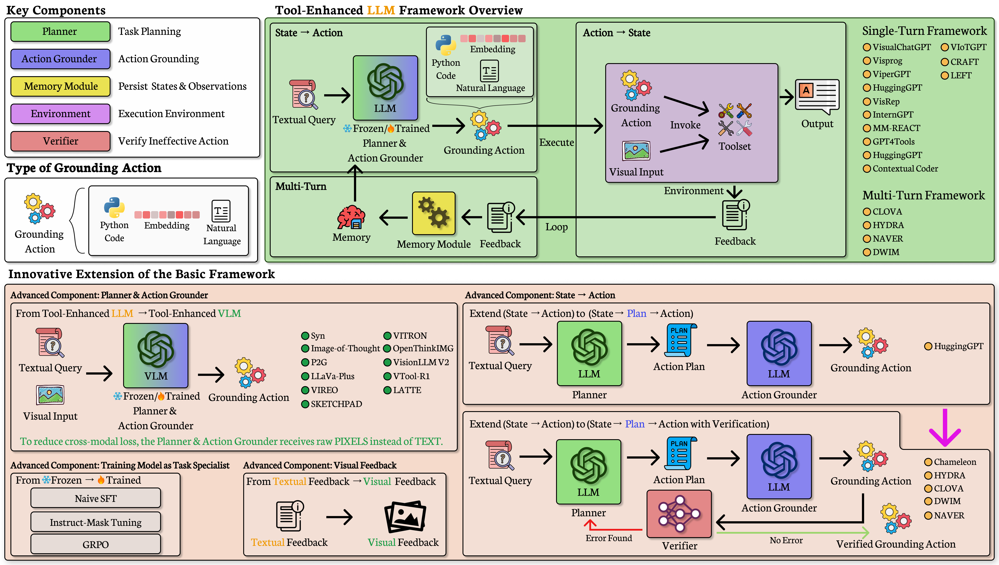
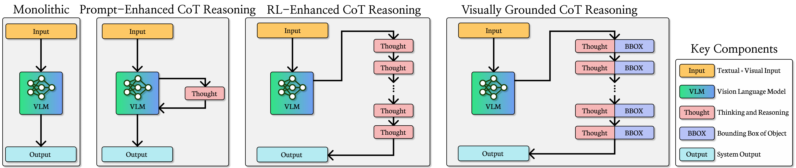
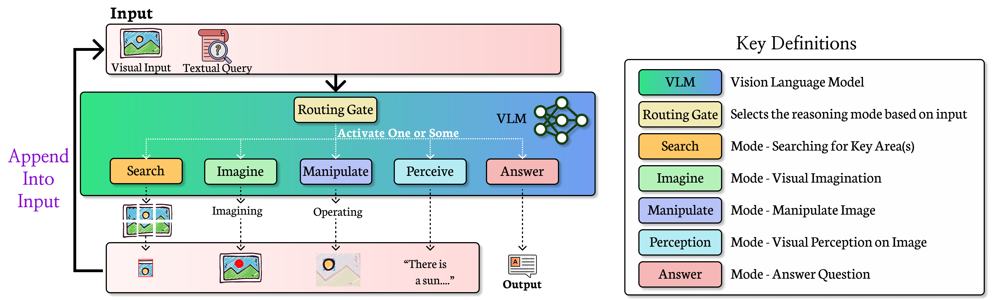

<div align="center">
  <h1>👨‍💻 Awesome Compositional Visual Reasoning</h1>
</div>


<p align="center">
  📄 <strong>This is our latest survey paper on compositional visual reasoning!</strong><br/>
  📚 <a href="https://arxiv.org/pdf/2508.17298" target="_blank"><strong>View the survey paper</strong></a>
</p>

<div align="center">
    <a href="https://github.com/pokerme7777/Compositional-Visual-Reasoning-Survey/network/members">
        
    </a>
    <a href="https://github.com/pokerme7777/Compositional-Visual-Reasoning-Survey/stargazers">
        
    </a>
    <a href="https://github.com/pokerme7777/Compositional-Visual-Reasoning-Survey/issues">
        
    </a>
    <a href="">
        
    </a>
</div>

<p align="center">
  
</p>


<p align="center">
    
</p>


## 📬 Contribute to This List

If you have related papers that should be included in this survey, feel free to [open an issue](https://github.com/pokerme7777/Compositional-Visual-Reasoning-Survey/issues). Contributions are welcome!


## 📘 Stages Overview

### Roadmap of Compositional Visual Reasoning Models
<p align="center">
  
</p>

---

### Key Shift from Monolithic Reasoning to Compositional Reasoning
<p align="center">
  
</p>

---

## [Stage I: Prompt-Enhanced Language-Centric](docs/stage1_prompt_language.md)
This stage focuses on methods where LLMs act as the central reasoning engine, guided by textual prompts. Visual inputs are often pre-processed or summarized before being fed into the LLM.


<p align="center">
  
</p>


### 🔹 Category 1: Task Decomposition Followed by Visual Perception

- **DDCoT**  
  Duty-Distinct Chain-of-Thought Prompting for Multimodal Reasoning in Language Models  
  [NeurIPS 2023](https://openreview.net/forum?id=ktYjrgOENR) / [Code](https://github.com/SooLab/DDCOT)

- **IdealGPT**  
  Iteratively Decomposing Vision and Language Reasoning via Large Language Models  
  [EMNLP 2023](https://arxiv.org/pdf/2305.14985) / [Code](https://github.com/Hxyou/IdealGPT)

- **Modeling Collaborator**  
  Enabling Subjective Vision Classification With Minimal Human Effort via LLM Tool-Use  
  [CVPR 2024](https://openaccess.thecvf.com/content/CVPR2024/papers/Toubal_Modeling_Collaborator_Enabling_Subjective_Vision_Classification_With_Minimal_Human_Effort_CVPR_2024_paper.pdf)

- **ChatCaptioner**  
  ChatGPT Asks, BLIP-2 Answers: Automatic Questioning Towards Enriched Visual Descriptions  
  [TMLR 2023](https://openreview.net/forum?id=1LoVwFkZNo) / [Code](https://github.com/Vision-CAIR/ChatCaptioner)

---


### 🔹 Category 2: Perceptual Grounding Prior to Reasoning

- **Cola**  
  Large Language Models are Visual Reasoning Coordinators  
  [NeurIPS 2023](https://proceedings.neurips.cc/paper_files/paper/2023/hash/ddfe6bae7b869e819f842753009b94ad-Abstract-Conference.html) / [Code](https://github.com/cliangyu/Cola)

- **MM-CoT**  
  Multimodal Chain-of-Thought Reasoning in Language Models  
  [TMLR 2024](https://arxiv.org/pdf/2302.00923) / [Code](https://github.com/amazon-science/mm-cot)

- **AdGPT**  
  Explore Meaningful Advertising with ChatGPT  
  [ACM MM 2025](https://dl.acm.org/doi/pdf/10.1145/3720546) / [Code](https://github.com/Rbrq03/AdGPT)

- **PromptCap**  
  Prompt-Guided Task-Aware Image Captioning  
  [ICCV 2023](https://openaccess.thecvf.com/content/ICCV2023/papers/Hu_PromptCap_Prompt-Guided_Image_Captioning_for_VQA_with_GPT-3_ICCV_2023_paper.pdf) / [Code](https://github.com/Yushi-Hu/PromptCap)

- **VCTP**  
  Visual Chain-of-Thought Prompting for Knowledge-Based Visual Reasoning  
  [AAAI 2024](https://ojs.aaai.org/index.php/AAAI/article/view/27888) / [Code](https://github.com/UMass-Embodied-AGI/VisualCoT)

- **Finedefics**  
  Analyzing and Boosting the Power of Fine-Grained Visual Recognition for Multi-modal Large Language Models  
  [ICLR 2025](https://openreview.net/forum?id=p3NKpom1VL) / [Code](https://github.com/PKU-ICST-MIPL/Finedefics_ICLR2025)

---

## [Stage II: Tool-Enhanced Large Language Models](docs/stage2_tool_llm.md)

This paradigm typically involves two key components: generating actions from the current state, and transitioning between states by executing those actions.

<p align="center">
  
</p>

- **ViperGPT**  
  ViperGPT: Visual Inference via Python Execution for Reasoning  
  [ICCV 2023](https://openaccess.thecvf.com/content/ICCV2023/papers/Suris_ViperGPT_Visual_Inference_via_Python_Execution_for_Reasoning_ICCV_2023_paper.pdf) / [Code](https://github.com/cvlab-columbia/viper)

- **Chameleon**  
  Chameleon: Plug-and-Play Compositional Reasoning with Large Language Models  
  [NeurIPS 2023](https://proceedings.neurips.cc/paper_files/paper/2023/file/871ed095b734818cfba48db6aeb25a62-Paper-Conference.pdf) / [Code](https://github.com/lupantech/chameleon-llm)

- **Visprog**  
  Visual Programming: Compositional Visual Reasoning Without Training  
  [CVPR 2023](https://openaccess.thecvf.com/content/CVPR2023/papers/Gupta_Visual_Programming_Compositional_Visual_Reasoning_Without_Training_CVPR_2023_paper.pdf) / [Code](https://github.com/allenai/visprog)

- **Visual ChatGPT**  
  Visual ChatGPT: Talking, Drawing and Editing with Visual Foundation Models  
  [arXiv 2023](https://arxiv.org/pdf/2303.04671) / [Code](https://github.com/chenfei-wu/TaskMatrix)

- **HuggingGPT**  
  HuggingGPT: Solving AI Tasks with ChatGPT and its Friends in Hugging Face  
  [NeurIPS 2023](https://proceedings.neurips.cc/paper_files/paper/2023/file/77c33e6a367922d003ff102ffb92b658-Paper-Conference.pdf) / [Code](https://github.com/microsoft/JARVIS)

- **GPT4Tools**  
  GPT4Tools: Teaching Large Language Model to Use Tools via Self-instruction  
  [NeurIPS 2023](https://proceedings.neurips.cc/paper_files/paper/2023/file/e393677793767624f2821cec8bdd02f1-Paper-Conference.pdf) / [Code](https://github.com/AILab-CVC/GPT4Tools)

- **InternGPT**  
  InternGPT: Solving Vision-Centric Tasks by Interacting with ChatGPT Beyond Language  
  [arXiv 2023](https://arxiv.org/pdf/2305.05662) / [Code](https://github.com/OpenGVLab/InternGPT)

- **ViotGPT**  
  VIoTGPT: Learning to Schedule Vision Tools Towards Intelligent Video Internet of Things  
  [AAAI 2025](https://ojs.aaai.org/index.php/AAAI/article/view/33160) / [Code](https://github.com/zhongyy/VIoTGPT)

- **MM-REACT**  
  MM-REACT: Prompting ChatGPT for Multimodal Reasoning and Action  
  [arXiv 2023](https://arxiv.org/pdf/2303.11381) / [Code](https://github.com/microsoft/MM-REACT)

- **VisRep**  
  Self-training Large Language Models for Improved Visual Program Synthesis with Visual Reinforcement  
  [CVPR 2024](https://openaccess.thecvf.com/content/CVPR2024/html/Khan_Self-Training_Large_Language_Models_for_Improved_Visual_Program_Synthesis_With_CVPR_2024_paper.html)

- **CRAFT**  
  CRAFT: Customizing LLMs by Creating and Retrieving from Specialized Toolsets  
  [ICLR 2024](https://openreview.net/forum?id=G0vdDSt9XM) / [Code](https://github.com/lifan-yuan/CRAFT)

- **CLOVA**  
  CLOVA: A Closed-LOop Visual Assistant with Tool Usage and Update  
  [CVPR 2024](https://openaccess.thecvf.com/content/CVPR2024/papers/Gao_CLOVA_A_Closed-LOop_Visual_Assistant_with_Tool_Usage_and_Update_CVPR_2024_paper.pdf) / [Code](https://github.com/clova-tool/CLOVA-tool)

- **HYDRA**  
  HYDRA: A Hyper Agent for Dynamic Compositional Visual Reasoning  
  [ECCV 2024](https://hydra-vl4ai.github.io/) / [Code](https://github.com/ControlNet/HYDRA)

- **ContextualCoder**  
  ContextualCoder: Adaptive In-context Prompting for Programmatic Visual Question Answering  
  [TMM 2025](https://ieeexplore.ieee.org/document/10891469)

- **ViUniT**  
  Visual Unit Tests for More Robust Visual Programming  
  [CVPR 2025](https://openaccess.thecvf.com/content/CVPR2025/papers/Panagopoulou_ViUniT_Visual_Unit_Tests_for_More_Robust_Visual_Programming_CVPR_2025_paper.pdf) / [Code](https://github.com/SalesforceAIResearch/visual-unit-testing)

- **SYNAPSE**  
  SYNAPSE: SYmbolic Neural-Aided Preference Synthesis Engine  
  [AAAI 2025](https://ojs.aaai.org/index.php/AAAI/article/view/34965) / [Code](https://github.com/ut-amrl/synapse)

- **NAVER**  
  NAVER: A Neuro-Symbolic Compositional Automaton for Visual Grounding with Explicit Logic Reasoning  
  [ICCV 2025](https://ojs.aaai.org/index.php/AAAI/article/view/34965) / [Code](https://github.com/ControlNet/NAVER)

- **DWIM**  
  DWIM: Towards Tool-aware Visual Reasoning via Discrepancy-aware Workflow Generation & Instruct-Masking Tuning  
  [ICCV 2025](https://github.com/pokerme7777/DWIM/) / [Code](https://github.com/pokerme7777/DWIM/) / [Website](https://pokerme7777.github.io/DWIM.github.io/)

- **LEFT**  
  What’s Left? Concept Grounding with Logic-Enhanced Foundation Models  
  [NeurIPS 2023](https://proceedings.neurips.cc/paper_files/paper/2023/file/79fea214543ba263952ac3f4e5452b14-Paper-Conference.pdf) / [Code](https://github.com/joyhsu0504/LEFT/)

---

## [Stage III: Tool-Enhanced Vision Language Models](docs/stage3_tool_vlm.md)
Tool-enhanced VLMs extend tool-enhanced LLMs by replacing the language model with a vision-language model, enabling direct visual interaction. Unlike tool-enhanced LLMs, planners here take raw images as input, reducing information loss and improving efficiency.

---

- **Image-of-Thought**  
  Image-of-Thought Prompting for Visual Reasoning Refinement in Multimodal Large Language Models  
  [arXiv 2024](https://arxiv.org/pdf/2405.13872)

- **P2G**  
  Plug-and-Play Grounding of Reasoning in Multimodal Large Language Models  
  [arXiv 2024](https://arxiv.org/pdf/2403.19322)

- **LLaVA-PLUS**  
  LLaVA-Plus: Learning to Use Tools for Creating Multimodal Agents  
  [ICLR 2024](https://openreview.net/forum?id=IB1HqbA2Pn) / [Code](https://github.com/LLaVA-VL/llava-plus)

- **VIREO**  
  From the Least to the Most: Building a Plug-and-Play Visual Reasoner via Data Synthesis  
  [EMNLP 2024](https://arxiv.org/pdf/2406.19934) / [Code](https://github.com/steven-ccq/VisualReasoner)

- **Openthinkimg**  
  OPENTHINKIMG: Learning to Think with Images via Visual Tool Reinforcement Learning  
  [arXiv 2025](https://arxiv.org/pdf/2505.08617) / [Code](https://github.com/zhaochen0110/OpenThinkIMG)

- **SKETCHPAD**  
  Visual Sketchpad: Sketching as a Visual Chain of Thought for Multimodal Language Models  
  [NeurIPS 2024](https://arxiv.org/pdf/2406.09403) / [Code](https://github.com/Yushi-Hu/VisualSketchpad)

- **VisionLLM v2**  
  VisionLLM v2: An End-to-End Generalist Multimodal Large Language Model for Hundreds of Vision-Language Tasks  
  [NeurIPS 2024](https://proceedings.neurips.cc/paper_files/paper/2024/file/81a60d18e010b27b36cd465c6604b915-Paper-Conference.pdf) / [Code](https://github.com/OpenGVLab/VisionLLM)

- **VITRON**  
  VITRON: A Unified Pixel-level Vision LLM for Understanding, Generating, Segmenting, Editing  
  [NeurIPS 2024](https://arxiv.org/pdf/2412.19806) / [Code](https://github.com/SkyworkAI/Vitron)

- **Syn**  
  Synthesize Step-by-Step: Tools, Templates and LLMs as Data Generators for Reasoning-Based Chart VQA  
  [CVPR 2024](https://openaccess.thecvf.com/content/CVPR2024/papers/Li_Synthesize_Step-by-Step_Tools_Templates_and_LLMs_as_Data_Generators_for_CVPR_2024_paper.pdf)

- **VTool-R1**  
  VTool-R1: VLMs Learn to Think with Images via Reinforcement Learning on Multimodal Tool Use  
  [arXiv 2025](https://arxiv.org/pdf/2505.19255) / [Code](https://github.com/VTool-R1/VTool-R1)

- **Self-Imagine**  
  Self-Imagine: Effective Unimodal Reasoning with Multimodal Models using Self-Imagination  
  [arXiv 2024](https://arxiv.org/pdf/2401.08025) / [Code](https://github.com/snat1505027/self-imagine)

- **Creative Agents**  
  Creative Agents: Empowering Agents with Imagination for Creative Tasks  
  [UAI 2025](https://openreview.net/forum?id=y0dbr5uSc9) / [Code](https://github.com/PKU-RL/Creative-Agents)

- **CoT-VLA**  
  CoT-VLA: Visual Chain-of-Thought Reasoning for Vision-Language-Action Models  
  [CVPR 2025](https://openaccess.thecvf.com/content/CVPR2025/papers/Zhao_CoT-VLA_Visual_Chain-of-Thought_Reasoning_for_Vision-Language-Action_Models_CVPR_2025_paper.pdf) / [Website](https://cot-vla.github.io/)

---

## [Stage IV: Chain-of-Thought Vision Language Models](docs/stage4_cot_vlm.md)
These models carry out multi-step reasoning in a single forward pass without external tools, explicitly exposing intermediate reasoning and perceptual states before the final answer.

---
<p align="center">
  
</p>

- **LLaVA-CoT**  
  LLaVA-CoT: Let Vision Language Models Reason Step-by-Step  
  [arXiv 2024](https://arxiv.org/pdf/2411.10440) / [Code](https://github.com/PKU-YuanGroup/LLaVA-CoT)

- **CCoT**  
  Compositional Chain-of-Thought Prompting for Large Multimodal Models  
  [CVPR 2024](https://openaccess.thecvf.com/content/CVPR2024/papers/Mitra_Compositional_Chain-of-Thought_Prompting_for_Large_Multimodal_Models_CVPR_2024_paper.pdf) / [Code](https://github.com/chancharikmitra/CCoT)

- **PaLI**  
  Visual Program Distillation: Distilling Tools and Programmatic Reasoning into Vision-Language Models  
  [CVPR 2024](https://arxiv.org/abs/2312.03052)

- **VOCoT**  
  VoCoT: Unleashing Visually Grounded Multi-Step Reasoning in Large Multi-Modal Models  
  [NAACL 2025](https://aclanthology.org/2025.naacl-long.192.pdf) / [Code](https://github.com/RupertLuo/VoCoT)

- **MM-GCoT**  
  Grounded Chain-of-Thought for Multimodal Large Language Models  
  [arXiv 2025](https://arxiv.org/pdf/2503.12799) / [Code](https://github.com/DoubtedSteam/MM-GCoT)

- **LLaVA-Aurora**  
  Perception Tokens Enhance Visual Reasoning in Multimodal Language Models  
  [CVPR 2025](https://openaccess.thecvf.com/content/CVPR2025/papers/Bigverdi_Perception_Tokens_Enhance_Visual_Reasoning_in_Multimodal_Language_Models_CVPR_2025_paper.pdf) / [Code](https://github.com/mahtabbigverdi/Aurora-perception)

- **DeepPerception**  
  DeepPerception: Advancing R1-like Cognitive Visual Perception in MLLMs for Knowledge-Intensive Visual Grounding  
  [arXiv 2025](https://arxiv.org/pdf/2503.12797) / [Code](https://github.com/thunlp/DeepPerception)

- **CoReS**  
  CoReS: Orchestrating the Dance of Reasoning and Segmentation  
  [ECCV 2024](https://arxiv.org/pdf/2404.05673) / [Code](https://github.com/baoxiaoyi/CoReS)

- **G1**  
  G1: Bootstrapping Perception and Reasoning Abilities of Vision-Language Model via Reinforcement Learning  
  [arXiv 2025](https://arxiv.org/abs/2505.13426) / [Code](https://github.com/chenllliang/G1)

- **Vision-R1**  
  Vision-R1: Incentivizing Reasoning Capability in Multimodal Large Language Models  
  [arXiv 2025](https://arxiv.org/pdf/2503.06749) / [Code](https://github.com/Osilly/Vision-R1)

- **Ground-R1**  
  Ground-R1: Incentivizing Grounded Visual Reasoning via Reinforcement Learning  
  [arXiv 2025](https://arxiv.org/pdf/2505.20272)

- **Griffon-R**  
  Understand, Think, and Answer: Advancing Visual Reasoning with Large Multimodal Models  
  [arXiv 2025](https://arxiv.org/abs/2505.20753) / [Code](https://github.com/zzzhhzzz/Ground-R1)

- **VISTAR**  
  Visually Interpretable Subtask Reasoning for Visual Question Answering  
  [CVPR 2025](https://openaccess.thecvf.com/content/CVPR2025W/XAI4CV/papers/Cheng_Visually_Interpretable_Subtask_Reasoning_for_Visual_Question_Answering_CVPRW_2025_paper.pdf) / [Code](https://github.com/ChengJade/VISTAR)

- **CoF**  
  Chain-of-Focus: Adaptive Visual Search and Zooming for Multimodal Reasoning via RL  
  [arXiv 2025](https://arxiv.org/pdf/2505.15436) / [Code](https://github.com/xtong-zhang/Chain-of-Focus)

- **LATTE**  
  LATTE: Learning to Think with Vision Specialists  
  [EMNLP 2025](https://arxiv.org/pdf/2412.05479) / [Code](https://github.com/SalesforceAIResearch/LATTE/)

- **VisRL**  
  VisRL: Intention-Driven Visual Perception via Reinforced Reasoning 
  [ICCV 2025](https://arxiv.org/abs/2503.07523) / [Code](https://github.com/zhangquanchen/VisRL/)
---

## [Stage V: Unified Agentic Vision Language Models](docs/stage5_agentic_vlm.md)

These models incorporate higher-order cognitive mechanisms such as planning, memory, operation, imagination, textual feedback and visual evidence.

<p align="center">
  
</p>

- **V\***  
  V\*: Guided Visual Search as a Core Mechanism in Multimodal LLMs  
  [CVPR 2024](https://openaccess.thecvf.com/content/CVPR2024/html/Wu_V_Guided_Visual_Search_as_a_Core_Mechanism_in_Multimodal_CVPR_2024_paper.html) / [Code](https://github.com/penghao-wu/vstar)

- **DC2**  
  Divide, Conquer and Combine: A Training-Free Framework for High-Resolution Image Perception in Multimodal Large Language Models  
  [AAAI 2025](https://ojs.aaai.org/index.php/AAAI/article/view/32852) / [Code](https://github.com/DreamMr/HR-Bench)

- **ZoomEye**  
  ZoomEye: Enhancing Multimodal LLMs with Human-Like Zooming Capabilities through Tree-Based Image Exploration  
  [arXiv 2024](https://arxiv.org/pdf/2411.16044) / [Code](https://github.com/om-ai-lab/ZoomEye)

- **FAST**  
  Visual Agents as Fast and Slow Thinkers  
  [ICLR 2025](https://arxiv.org/pdf/2408.08862) / [Code](https://github.com/GuangyanS/Sys2-LLaVA)

- **CogCoM**  
  CogCoM: Train Large Vision-Language Models Diving into Details through Chain of Manipulations  
  [ICLR 2025](https://arxiv.org/pdf/2402.04236) / [Code](https://github.com/THUDM/CogCoM)

- **GeReA**  
  GeReA: Question-Aware Prompt Captions for Knowledge-based Visual Question Answering  
  [arXiv 2024](https://arxiv.org/pdf/2402.02503) / [Code](https://github.com/Upper9527/GeReA)

- **Insight-V**  
  Insight-V: Exploring Long-Chain Visual Reasoning with Multimodal Large Language Models  
  [CVPR 2025](https://github.com/dongyh20/Insight-V) / [Code](https://github.com/dongyh20/Insight-V)

- **Argus**  
  Argus: Vision-Centric Reasoning with Grounded Chain-of-Thought  
  [CVPR 2025](https://openaccess.thecvf.com/content/CVPR2025/papers/Man_Argus_Vision-Centric_Reasoning_with_Grounded_Chain-of-Thought_CVPR_2025_paper.pdf)

- **Mirage**  
  Machine Mental Imagery: Empower Multimodal Reasoning with Latent Visual Tokens  
  [arXiv 2025](https://arxiv.org/pdf/2506.17218) / [Code](https://github.com/UMass-Embodied-AGI/Mirage)

- **FOREWARN**  
  From Foresight to Forethought: VLM-In-the-Loop Policy Steering via Latent Alignment  
  [RSS 2025](https://www.roboticsproceedings.org/rss21/p076.pdf) / [Code](https://yilin-wu98.github.io/forewarn/)

- **VisCoT**  
  Visual CoT: Advancing Multi-Modal Language Models with a Comprehensive Dataset and Benchmark for Chain-of-Thought Reasoning  
  [NeurIPS 2024](https://arxiv.org/pdf/2403.16999) / [Code](https://github.com/deepcs233/Visual-CoT/)

- **ViGoRL**  
  Grounded Reinforcement Learning for Visual Reasoning  
  [arXiv 2025](https://arxiv.org/abs/2505.23678) / [Code](https://github.com/Gabesarch/grounded-rl/)

- **ViGoRL**  
  SIFThinker: Spatially-Aware Image Focus for Visual Reasoning 
  [arXiv 2025](https://arxiv.org/abs/2508.06259) / [Code](https://github.com/zhangquanchen/SIFThinker/)

## 🌟Star History

<a href="https://star-history.com/#pokerme7777/Compositional-Visual-Reasoning-Survey&Timeline">
  <picture>
    <source media="(prefers-color-scheme: dark)" srcset="https://api.star-history.com/svg?repos=pokerme7777/Compositional-Visual-Reasoning-Survey&type=Timeline&theme=dark" />
    <source media="(prefers-color-scheme: light)" srcset="https://api.star-history.com/svg?repos=pokerme7777/Compositional-Visual-Reasoning-Survey&type=Timeline" />
    
  </picture>
</a>

## 📖Citation
If you find this work useful for your research, please consider citing it.
```bibtex
@misc{ke2025explainanswersurveycompositional,
      title={Explain Before You Answer: A Survey on Compositional Visual Reasoning}, 
      author={Fucai Ke and Joy Hsu and Zhixi Cai and Zixian Ma and Xin Zheng and Xindi Wu and Sukai Huang and Weiqing Wang and Pari Delir Haghighi and Gholamreza Haffari and Ranjay Krishna and Jiajun Wu and Hamid Rezatofighi},
      year={2025},
      eprint={2508.17298},
      archivePrefix={arXiv},
      primaryClass={cs.CV},
      url={https://arxiv.org/abs/2508.17298}, 
}
```

